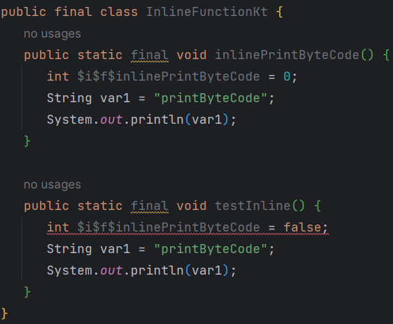
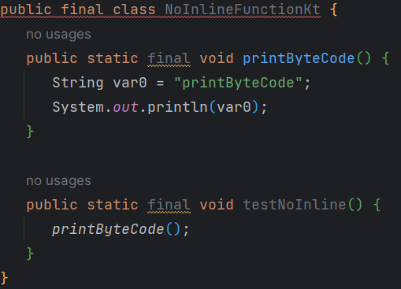
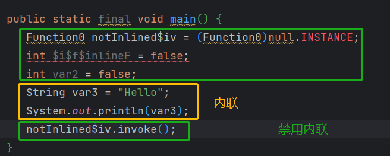

---
categories:
- Kotlin
date: "2025-08-15T15:22:54+08:00"
tags:
- Develop
title: Kotlin内联函数
---

## 什么是内联函数
在 Kotlin 中通过 `inline-functions` (内联函数) 实现函数内联。

内联的作用：提升运行效率，调用被 `inline` 修饰符的函数，**会把方法体内的代码放到调用的地方**，其主要目的提高性能，减少对象的创建。

---
## `inline` 修饰的函数适用于以下情况
- `inline` 修饰符适用于把函数作为另一个函数的参数，例如高阶函数 `filter` 、 `map` 、 `joinToString` 或者一些独立的函数 `repeat`
- `inline` 操作符适合和 `reified` 操作符结合在一起使用
- 如果函数体很短，使用 `inline` 操作符提高效率
## 字节码
1. 内联函数字节码
```kotlin
//Inline Function
inline fun inlinePrintByteCode() {  
	println("printByteCode")  
}  
  
fun testInline() {  
	inlinePrintByteCode()  
}
```


---
2. 非函数内联字节码
```kotlin
fun printByteCode() {  
	println("printByteCode")  
}  
  
fun testNoInline() {  
	printByteCode()  
}
```


## 禁用内联
- 如果希望只内联一部分传给内联函数的 lambda 表达式参数，那么可以用 `noinline` 修饰符标记不希望内联的函数参数
```kotlin
inline fun inlineF(inlined: () -> Unit, noinline notInlined: () -> Unit) {  
	inlined()  
	notInlined()  
}  
  
fun main() {  
	inlineF({println("Hello")}, {println("World")})  
}
```


> [内联函数与具体化的类型参数 - Kotlin 语言中文站 (kotlincn.net)](https://www.kotlincn.net/docs/reference/inline-functions.html)
> 
> [Inline functions | Kotlin Documentation (kotlinlang.org)](https://kotlinlang.org/docs/inline-functions.html)