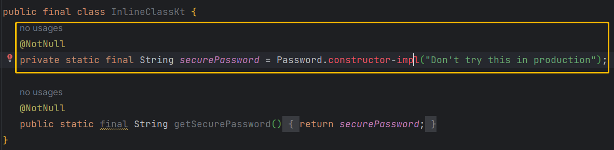
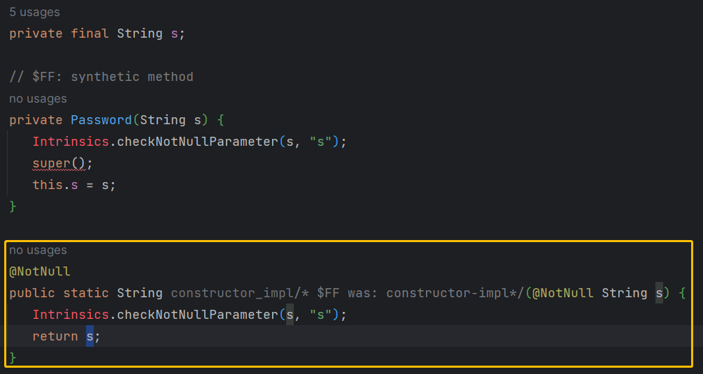

# 内联类（Value Class）
- `Inline classes` 是 `Value classes` 的子集， `Value classes` 比 `Inline classes` 会得到更多优化，现阶段 `Value classes`  和 `Inline classes` 一样，只能在构造函数中传入一个参数，参数需要用 `val` 声明，将来可以在构造函数中添加多个参数，但是每个参数都需要用  `val` 声明。
## 声明一个内联类（value class）
需要
- `value class` 关键字
- `@JvmInline` 注解
- 主构造函数有且只能有一个属性

```kotlin
// For JVM backends
@JvmInline 
value class Password(private val s: String)

// No actual instantiation of class 'Password' happens
// At runtime 'securePassword' contains just 'String' 
val securePassword = Password("Don't try this in production")
```



## 成员
- `value class` 允许声明属性（可计算属性、不支持**幕后属性**）或方法和`init` 初始块。
```kotlin
@JvmInline  
value class Name(val s: String){  
	init {  
		require(s.isNotEmpty())  
	}  
	  
	val length : Int get() = s.length  
	  
	fun greet(){  
		println("Hello, $s")  
	}  
}

fun main() {  
	val name = Name("kotlin")  
	name.greet()  
	println(name.length)  
}
```

## 继承
- `Value Class` 编译后将会添加 `fianl` 修饰符，因此不能被继承，同样也不能继承其他的类；**但是可以实现接口**。
```kotlin
interface Printable {  
	fun prettyPrint(): String  
}

@JvmInline  
value class Name(val s: String) : Printable {  
	override fun prettyPrint(): String = "Let's $s!"
}
```

## 表现形式
- Kotlin 编译器会用一个容器(wrapper)包装内联类。
- 在运行时内联类实体可以表现为**包装类**或者**内联的具体类型**。(Inline class instances can be represented at runtime either as wrappers or as the underlying type.)
	- 正是因为内联类有两种表现形式，所以引用相等( === )会被禁止使用。(Because inline classes may be represented both as the underlying value and as a wrapper, [referential equality](https://kotlinlang.org/docs/equality.html#referential-equality) is pointless for them and is therefore prohibited.)
- Kotlin 编译器会优先使用具体的类型来提高性能和优化代码，但有些场景将会保留包装类。(The Kotlin compiler will prefer using underlying types instead of wrappers to produce the most performant and optimized code. However, sometimes it is necessary to keep wrappers around.)
- **内联类在被用于其他类型的时候将表现为包装类。**(As a rule of thumb, inline classes are boxed whenever they are used as another type.)
	- `Foo` 和 `Foo?`不是同样的类型，所以也表现为包装类。
```kotlin
interface I

@JvmInline
value class Foo(val i: Int) : I

fun asInline(f: Foo) {}
fun <T> asGeneric(x: T) {}
fun asInterface(i: I) {}
fun asNullable(i: Foo?) {}

fun <T> id(x: T): T = x

fun main() {
    val f = Foo(42)

    asInline(f)    // unboxed: used as Foo itself
    asGeneric(f)   // boxed: used as generic type T
    asInterface(f) // boxed: used as type I
    asNullable(f)  // boxed: used as Foo?, which is different from Foo

    // below, 'f' first is boxed (while being passed to 'id') and then unboxed (when returned from 'id')
    // In the end, 'c' contains unboxed representation (just '42'), as 'f'
    val c = id(f)
}
```


## 破坏性？
- 编译器会将内联类编译成它们的内联属性，但由于内联属性和原有的属性相冲，出现错误。如
```kotlin
@JvmInline
value class UInt(val x: Int)

fun compute(x: Int) { }

fun compute(x: UInt) { }
```
两个`compute` 方法将会在JVM平台编译成`public final void compute(int x)`，出现相冲。
- 解决方法是：编译器将会把内联函数的方法名加上hashcode，形式是`public final void compute-<hashcode>(int x)`。
	- 
- 因为这个破坏性，Java调用的时候不知道加的hashcode是什么，通过加`@JvmName`注解给方法一个别名。
```kotlin
@JvmInline
value class UInt(val x: Int)

fun compute(x: Int) { }

@JvmName("computeUInt")
fun compute(x: UInt) { }
```


> [Inline classes | Kotlin Documentation (kotlinlang.org)](https://kotlinlang.org/docs/inline-classes.html)
> 
> [Design Notes on Kotlin Value Classes](https://github.com/Kotlin/KEEP/blob/master/notes/value-classes.md#design-notes-on-kotlin-value-classes)