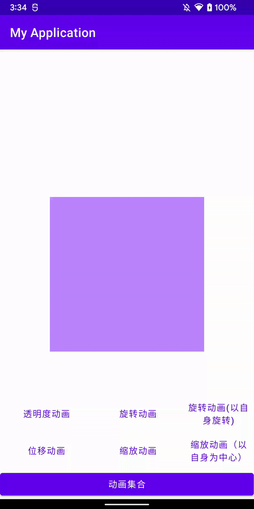

## Android View 动画框架
>
> Animation框架定义了透明度、旋转、缩放和位移几种常见的动面，而且控制的是整个view，实现原理是每次绘制视图时 View 所在的 ViewGroup 中的drawChild 函数获取该 View 的Animation 的 Transformation 值，然后调用 canvas.concat(transformToApply.getMatrix())，通过矩阵运算完成动画帧。如果动画没有完成，就继续调用 invalidate()函数，启动下次绘制來驱动动画，从而完成整个动画的绘制。——《Android群英传》



## 视图动画四种动画方式

### AlphaAnimation（透明度动画）

- 为视图添加透明度的变换动画。
- 构建`AlphaAnimation`2个参数
| 属性 | 属性描述 |
| :--- | :--- |
| `fromAlpha` | 开始的透明度 |
| `toAlpha` | 结束的透明度 |

```kotlin
//透明度从0到1，时长1秒
private fun alphaAnimation(v: View) {
    with(AlphaAnimation(0F, 1F)) {
        duration = 1000
        v.startAnimation(this)
    }
}
```

### RotateAnimation（旋转动画）

- 为视图增加旋转的变换动画。
- 构建`RotateAnimation`6个参数

| 属性 | 属性描述 |
| :--- | :--- |
| `fromDegrees` | 旋转开始的角度 |
| `toDegrees` | 旋转结束的角度 |
| `pivotXType` | 旋转中心点X的类型：`ABSOLUTE` (默认)表示X值是View的绝对坐标；`RELATIVE_TO_SELF`表示X值是View宽度的百分比；`RELATIVE_TO_PARENT`表示X值是父布局宽度的百分比。 |
| `pivotXValue` | 旋转中心点X的取值（默认为0）。如果 `pivotXType` 不是 `ABSOLUTE`，则取值范围是0.0到1.0。 |
| `pivotYType` | 旋转中心点Y的类型：`ABSOLUTE` (默认)表示Y值是View的绝对坐标；`RELATIVE_TO_SELF`表示Y值是View高度的百分比；`RELATIVE_TO_PARENT`表示Y值是父布局高度的百分比。 |
| `pivotYValue` | 旋转中心点Y的取值（默认为0）。如果 `pivotYType` 不是 `ABSOLUTE`，则取值范围是0.0到1.0。 |

```kotlin
//以View的（0，0）点为中心（即左上角），从0度旋转到360度，时长1秒。
private fun rotateAnimation(v: View) {
    with(RotateAnimation(0F, 360F, 0F, 0F)) {
        duration = 1000
        v.startAnimation(this)
    }
}
//以View的宽高一半的点为中心（即View正中心），从0度旋转到360度，时长1秒。
private fun rotateSelfAnimation(v: View) {
    with(
        RotateAnimation(
            0F,
            360F,
            RotateAnimation.RELATIVE_TO_SELF,
            0.5F,
            RotateAnimation.RELATIVE_TO_SELF,
            0.5F
        )
    ) {
        duration = 1000
        v.startAnimation(this)
    }
}
```

### TranslateAnimation（位移动画）

- 为视图移动时增加位移动画。
- 构建`TranslateAnimation`的8个参数

| 属性 | 属性描述 |
| :--- | :--- |
| `fromXType` | 移动前X的取值类型：`ABSOLUTE` (默认)表示View的绝对值；`RELATIVE_TO_SELF`表示View宽度的百分比；`RELATIVE_TO_PARENT`表示父布局宽度的百分比。 |
| `fromXValue` | 移动前的X位置（如果`fromXType`不是`ABSOLUTE`，则取值范围是0.0到1.0）。 |
| `toXType` | 移动后X的取值类型：`ABSOLUTE` (默认)表示View的绝对值；`RELATIVE_TO_SELF`表示View宽度的百分比；`RELATIVE_TO_PARENT`表示父布局宽度的百分比。 |
| `toXValue` | 移动后的X位置（如果`toXType`不是`ABSOLUTE`，则取值范围是0.0到1.0）。 |
| `fromYType` | 移动前Y的取值类型：`ABSOLUTE` (默认)表示View的绝对值；`RELATIVE_TO_SELF`表示View高度的百分比；`RELATIVE_TO_PARENT`表示父布局高度的百分比。 |
| `fromYValue` | 移动前的Y位置（如果`fromYType`不是`ABSOLUTE`，则取值范围是0.0到1.0）。 |
| `toYType` | 移动后Y的取值类型：`ABSOLUTE` (默认)表示View的绝对值；`RELATIVE_TO_SELF`表示View高度的百分比；`RELATIVE_TO_PARENT`表示父布局高度的百分比。 |
| `toYValue` | 移动后的Y位置（如果`toYType`不是`ABSOLUTE`，则取值范围是0.0到1.0）。 |

```kotlin
//以View（0，0）点即左上角移到（200，300）的位置，时长1秒
private fun translateAnimation(v: View) {
    with(TranslateAnimation(0F, 200F, 0F, 300F)) {
        duration = 1000
        v.startAnimation(this)
    }
}
```

### ScaleAnimation（缩放动画）

- 为视图的缩放增加动画效果。
- 构建`ScaleAnimation`的8个参数

| 属性 | 属性描述 |
| :--- | :--- |
| `fromX` | 水平方向初始缩放比例。 |
| `toX` | 水平方向结束缩放比例。 |
| `fromY` | 垂直方向初始缩放比例。 |
| `toY` | 垂直方向结束缩放比例。 |
| `pivotXType` | 缩放中心点X的取值类型：`ABSOLUTE` (默认)表示View的绝对值；`RELATIVE_TO_SELF`表示View宽度的百分比；`RELATIVE_TO_PARENT`表示父布局宽度的百分比。 |
| `pivotXValue` | 动画缩放中心点的X值（默认为0）。如果 `pivotXType` 不是`ABSOLUTE`，则取值范围是0.0到1.0。 |
| `pivotYType` | 缩放中心点Y的取值类型：`ABSOLUTE` (默认)表示View的绝对值；`RELATIVE_TO_SELF`表示View高度的百分比；`RELATIVE_TO_PARENT`表示父布局高度的百分比。 |
| `pivotYValue` | 动画缩放中心点的Y值（默认为0）。如果 `pivotYValue` 不是`ABSOLUTE`，则取值范围是0.0到1.0。 |

```kotlin
//以View（0，0）点即左上角从宽高为0缩放到原宽高的2倍，时长1秒
private fun scaleAnimation(v: View) {
    with(ScaleAnimation(0F, 2F, 0F, 2F)) {
        duration = 1000
        v.startAnimation(this)
    }
}

//以View的宽高一半的点为中心（即View正中心）从宽高为0缩放到原宽高的1倍，时长1秒
private fun scaleSelfAnimation(v: View) {
    with(
        ScaleAnimation(
            0F,
            1F,
            0F,
            1F,
            Animation.RELATIVE_TO_SELF,
            0.5F,
            Animation.RELATIVE_TO_SELF,
            0.5F
        )
    ) {
        duration = 1000
        v.startAnimation(this)
    }
}
```

## AnimationSet（动画集合）

- 通过AnimationSet可以将动画以组合的形式展现出来
- 构造`AnimationSet`的1个参数
  - shareInterpolator 是否集合内的动画和AnimationSet公用一个插值器，否则每个动画各用回自己的插值器。

```kotlin
private fun animationSet(v: View) {
    val animationSet = AnimationSet(true).apply { duration = 1000 }
    val alpha = AlphaAnimation(0F, 1F).apply { duration = 1000 }
    animationSet.addAnimation(alpha)
    val translate = TranslateAnimation(0F, 100F, 0F, 200F).apply { duration = 1000 }
    animationSet.addAnimation(translate)
    v.startAnimation(animationSet)
}
```
