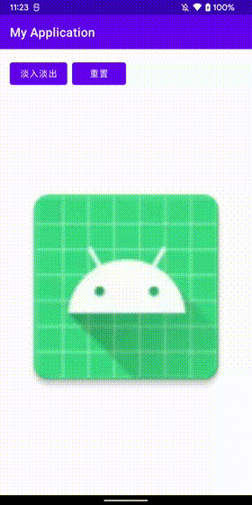

在安卓开发中，常用淡入淡出的动画来显示加载中的效果。比如在加载新闻列表时，先显示骨架屏动画，当请求成功后，骨架屏以淡出的形式消失，新闻列表项以淡入的形式出现。或者是加载图片的时候，默认显示一个空的图片或占位图片，当图片加载成功，占位图片以淡出的形式消失，加载的图片以淡入的形式显示。

---

一个简单的例子。以Android Logo作为占位图，员工头像为请求的图片。


## 实现淡入淡出动画

### 1、准备两个ImageView

一个ImageView显示占位图，一个显示ImageView请求的图片。请求图片的ImageView的visibility默认是`Gone`。

```xml
<FrameLayout
    android:layout_width="match_parent"
    android:layout_height="0dp"
    android:layout_weight="1">
    <ImageView
        android:id="@+id/v_content"
        android:layout_width="match_parent"
        android:layout_height="match_parent"
        android:src="@drawable/profile_picture"
        android:visibility="gone" />
    <ImageView
        android:id="@+id/v_loading"
        android:layout_width="match_parent"
        android:layout_height="match_parent"
        android:src="@mipmap/ic_launcher" />
</FrameLayout>
```

### 2、执行动画

把加载图片的ImageView的visibility设为`VISIBLE`，并执行从透明到不透明的动画，实现淡入效果。占位图的ImageView执行不透明到透明的动画，实现淡出效果，监听动画回调，当动画执行结束后，将占位图的visibility设为`GONE`。

```kotlin
//动画时长
val shortAnimationDuration = resources.getInteger(android.R.integer.config_longAnimTime).toLong()

private fun crossFade() {
    content.run {
        //淡入的View从初始状态的GONE切换成Visible，然后通过透明度0隐藏。
        visibility = View.VISIBLE
        alpha = 0F
        //执行动画
        animate()
            .alpha(1F)
            .setDuration(shortAnimationDuration)
    }
    loading.animate()
        .alpha(0F)
        .setDuration(shortAnimationDuration)
        .setListener(object : AnimatorListenerAdapter() {
            override fun onAnimationEnd(animation: Animator?) {
                super.onAnimationEnd(animation)
                loading.visibility = View.GONE
            }
        })
}
```
