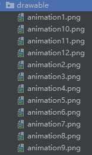
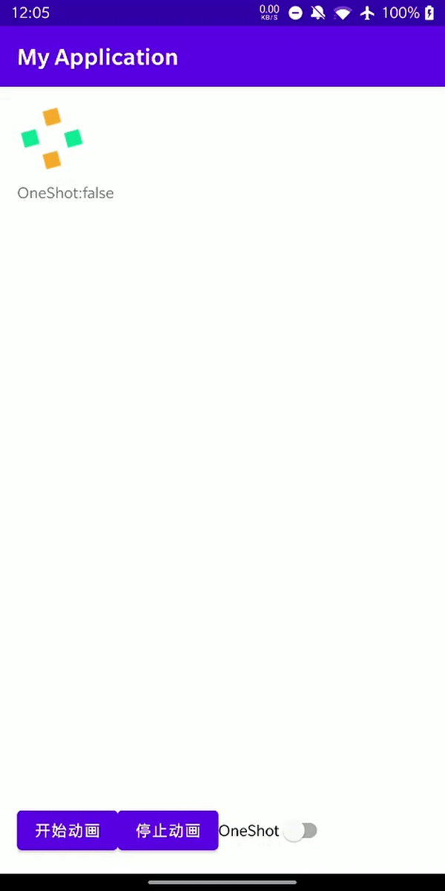

## **帧动画是什么**

首先动画本质就是连成连贯动作的一帧帧静态图快速切换的效果。帧：就是影像动画中最小单位的单幅影像画面，相当于电影胶片上的每一格镜头。一帧就是一副静止的画面，连续的帧就形成动画，如电视图象等。

## **在Android实现帧动画**

### 1、准备素材

将[图片资源](frame_anim_drawable.zip)放在`drawable`文件夹。如图所示👇



### 2、编写动画资源文件

在`drawable`文件夹下新建`frame_anim.xml`文件。文件内容如下

``` xml
<?xml version="1.0" encoding="utf-8"?>
<animation-list xmlns:android="http://schemas.android.com/apk/res/android"
    android:oneshot="false">
    <item
        android:drawable="@drawable/animation1"
        android:duration="200" />
    <item
        android:drawable="@drawable/animation2"
        android:duration="200" />
    <item
        android:drawable="@drawable/animation3"
        android:duration="200" />
    <item
        android:drawable="@drawable/animation4"
        android:duration="200" />
    <item
        android:drawable="@drawable/animation5"
        android:duration="200" />
    <item
        android:drawable="@drawable/animation6"
        android:duration="200" />
    <item
        android:drawable="@drawable/animation7"
        android:duration="200" />
    <item
        android:drawable="@drawable/animation8"
        android:duration="200" />
    <item
        android:drawable="@drawable/animation9"
        android:duration="200" />
    <item
        android:drawable="@drawable/animation10"
        android:duration="200" />
    <item
        android:drawable="@drawable/animation11"
        android:duration="200" />
    <item
        android:drawable="@drawable/animation12"
        android:duration="200" />
</animation-list>
```

### 3、添加显示帧动画的ImageView

``` xml
<ImageView
    android:id="@+id/img_frame"
    android:layout_width="wrap_content"
    android:layout_height="wrap_content"
    tools:src="@mipmap/ic_launcher" />
```

### 4、编写实现帧动画的代码

```kotlin
findViewById<ImageView>(R.id.img_frame).apply {
    setBackgroundResource(R.drawable.frame_anim)
    frameAnimation = background as AnimationDrawable
    tvOneShot.text = "OneShot:${frameAnimation.isOneShot}"
}

//开始动画
findViewById<Button>(R.id.btn_start).setOnClickListener {
    frameAnimation.start()
}
```

### 5、效果

|||
|:---:|:---:|
|no_one_shot|one_shot|