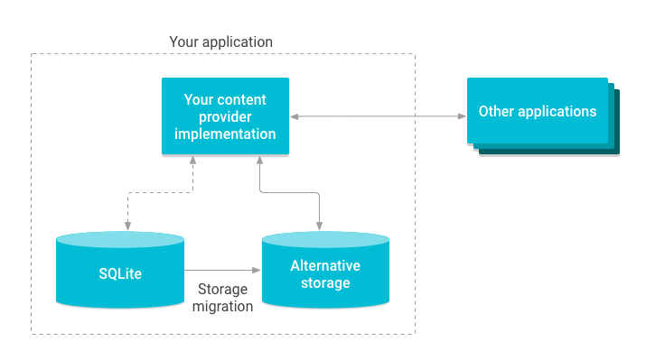
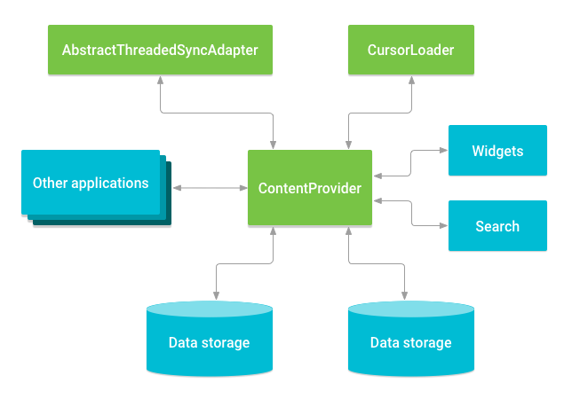

## ContentProvider作用

* ContentProvider可以帮助APP去管理数据的访问，无论是自身存储的数据还是来自其他APP的数据。
* ContentProvider封装了数据并提供了一个数据安全的机制，可以让其他应用安全地访问你的APP的数据。

* ContentProvider是一个能将数据一个进程与另外一个进程交互的标准接口。

## ContentProvider工作原理

ContentProvider以一个或多个表的形式将数据呈现给其他应用，其中每一行代表的是provider中收集的某种类型数据的一个实例，每一列代表的是一个实例中所收集的单个数据。

一个ContentProvider通过提供多个不同的API和组件来协调对你的应用的数据存储层的访问。例如下图所示


1. 分享你的应用数据给其他应用。
2. 发送数据给widget
3. 使用[SearchRecentSuggestionsProvider](https://developer.android.com/guide/topics/providers/content-provider-basics#:~:text=SearchRecentSuggestionsProvider)，透过搜索框架返回自定义的搜索建议给自身应用。
4. 通过实现[AbstractThreadedSyncAdapter](https://developer.android.com/reference/android/content/AbstractThreadedSyncAdapter)来与服务器同步你的应用数据。
5. 通过[CursorLoader](https://developer.android.com/reference/android/content/CursorLoader)在UI中加载数据。

## ContentProvider的权限

如果不打算其他应用能够访问自己定义的`ContentProvider`，则需要在`AndroidManifest.xml`中指定`android:exported=false`。

当你允许其他应用可以访问你的`ContentProvider`的时候，还可以指定允许读取和写入的单一权限(`android:permission`)，也可以针对读取和写入分别指定权限(`android:readPermission`、`android:writePermission`)。

## ContentProvider的使用

如果想访问一个ContentProvider的数据，可以使用应用上下文`Context`的[ContentResolver](https://developer.android.com/reference/android/content/ContentResolver)实例作为一个客户端和provider进行数据交互通信。

### 插入数据

如果需要将数据插入到ContentProvider，可以通过调用`ContentResolver.insert()`的方法，该方法会在ContentProvider插入新行，并返回该内容Uri。

其中`_ID`列是系统自动维护的，当插入新行的时候系统会为该行自动分配唯一的`_ID`值，通常程序会将这个值作为表的主键。如果需要从返回的Uri中获取`_ID`值，可以直接调用`ContentUrls.parseId()`。

可见[插入联系人](#2插入联系人)

### 更新数据

如果需要更新数据到ContentProvider，可以通过调用`ContentResolver.update()`的方法，同时支持选择条件。如果需要清除列的数据，调用`ContentValues.putNull()`的方法。

## ContentProvider支持的数据类型

* 文本
* 整数
* 长整型（long）
* 浮点型（float）
* 长浮点型（long）
* 二进制大型对象（BLOB）

可以通过`Cursor.getType()`来确定数据类型。

---

举个例子操作设备通讯录。

### 1.请求读取访问权限

读取设备通讯录需要有`android.permission.READ_CONTACTS`权限，修改设备通讯录需要有`android.permission.WRITE_CONTACTS`权限, 在清单中定义`<uses-permission android:name="android.permission.READ_CONTACTS" />`和`<uses-permission android:name="android.permission.WRITE_CONTACTS" />`， 由于读取和修改通讯录权限是运行时权限，所以还需要在代码中动态获取。

### 2.插入联系人

```kotlin
    private fun insert(context: Context) {
        val resolver = context.contentResolver
        val val1: ContentValues = ContentValues() {
            put(
                ContactsContract.RawContacts.ACCOUNT_TYPE,
                ContactsContract.RawContacts.getLocalAccountType(context)
            )
            put(
                ContactsContract.RawContacts.ACCOUNT_NAME,
                ContactsContract.RawContacts.getLocalAccountName(context)
            )
        }
        val insertUri1: Uri? = resolver.insert(ContactsContract.RawContacts.CONTENT_URI, val1)
        insertUri1 ?: return
        Log.d(TAG, "insertUri1: $insertUri1")
        // insertUri1: content://com.android.contacts/raw_contacts/55
        val id = ContentUris.parseId(insertUri1)
        Log.d(TAG, "id: $id")
        // id: 55
        val val2: ContentValues = ContentValues().apply {
            put(ContactsContract.Data.RAW_CONTACT_ID, id)
            put(
                ContactsContract.Data.MIMETYPE,
                ContactsContract.CommonDataKinds.StructuredName.CONTENT_ITEM_TYPE
            )
            put(
                ContactsContract.CommonDataKinds.StructuredName.DISPLAY_NAME,
                "TT Insert:${System.currentTimeMillis()}"
            )
        }
        val insertUri2: Uri? = resolver.insert(ContactsContract.Data.CONTENT_URI, val2)
        insertUri2 ?: return
        Log.d(TAG, "insertUri2: $insertUri2")
        // insertUri2: content://com.android.contacts/data/263
    }
```

### 3.更新联系人


## ContetntProvider清单文件配置

```xml
<provider android:authorities="list"
          android:directBootAware=["true" | "false"]
          android:enabled=["true" | "false"]
          android:exported=["true" | "false"]
          android:grantUriPermissions=["true" | "false"]
          android:icon="drawable resource"
          android:initOrder="integer"
          android:label="string resource"
          android:multiprocess=["true" | "false"]
          android:name="string"
          android:permission="string"
          android:process="string"
          android:readPermission="string"
          android:syncable=["true" | "false"]
          android:writePermission="string" >
    ...
</provider>
```

[provider清单配置文档链接](https://developer.android.com/guide/topics/manifest/provider-element)
