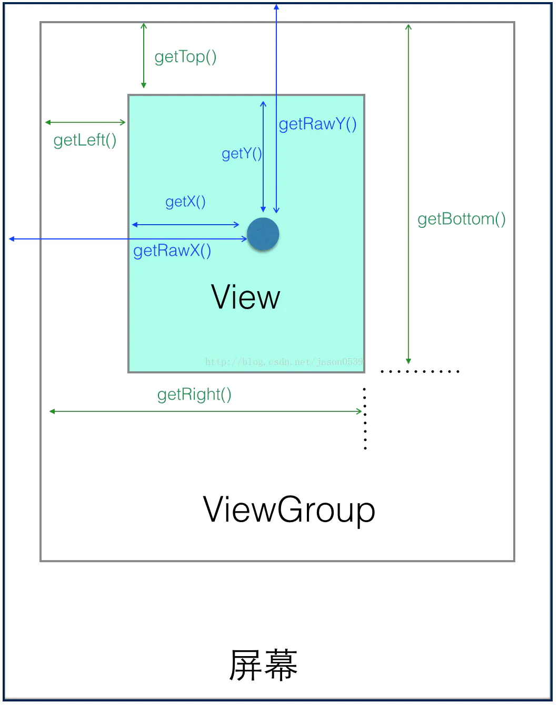

在Android系统中，我们把屏幕左上角的顶点作为Android坐标系的原点，**这个原点向右是X轴正方向，向下是Y轴正方向**。


## View坐标系

 一个View的位置主要由它的四个顶点决定，这四个顶点坐标是基于View的父容器来说的，是一组**相对坐标**。

* 左上角纵坐标（top）
* 左上角横坐标（left）
* 右下角横坐标（right）
* 右下角纵坐标（bottom）



### 获取View自身坐标

通过如下方法可以获得View到其父控件（ViewGroup）的距离。

* `getTop()`：获取View自身顶边到其父布局顶边的距离。
* `getLeft()`：获取View自身左边到其父布局左边的距离。
* `getRight()`：获取View自身右边到其父布局左边的距离。
* `getBottom()`：获取View自身底边到其父布局顶边的距离。

### 获取MotionEvent的坐标

上图那个深蓝色的点，假设就是我们触摸的点，我们知道**无论是View还是ViewGroup，最终的点击事件都会由onTouchEvent(MotionEvent event)方法来处理**，MotionEvent也提供了各种获取焦点坐标的方法。

* `getX()`：获取点击事件距离控件左边的距离，即视图坐标
* `getY()`：获取点击事件距离控件顶边的距离，即视图坐标
* `getRawX()`：获取点击事件距离整个屏幕左边距离，即绝对坐标
* `getRawY()`：获取点击事件距离整个屏幕顶边的的距离，即绝对坐标。

## View的宽高

由上图可知，一个View的宽度是 `getRight()` - `getLeft()`；高度是 `getBottom()` - `getTop()`。

```java
/**  
 * Return the width of your view. 
 * 
 * @return The width of your view, in pixels.  
 */
@ViewDebug.ExportedProperty(category = "layout")  
public final int getWidth() {  
    return mRight - mLeft;  
}  
  
/**  
 * Return the height of your view. 
 * 
 * @return The height of your view, in pixels.  
 */
@ViewDebug.ExportedProperty(category = "layout")  
public final int getHeight() {  
    return mBottom - mTop;  
}
```
