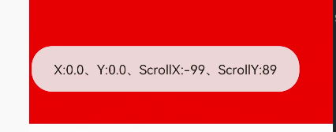

## 使用  `layout()` 方法实现滑动

View进行绘制的时候会调用`onLayout()`方法来设置显示的位置，因此我们同样也可以**通过修改View的left、top、right、bottom这四种属性来控制View的坐标。** 首先我们要自定义一个View，在onTouchEvent()方法中获取触摸点的坐标：

```kotlin
class CustomView @JvmOverloads constructor(  
    context: Context, attrs: AttributeSet? = null, defStyleAttr: Int = 0  
) : View(context, attrs, defStyleAttr) {  
  
    private var lastX: Int = 0  
    private var lastY: Int = 0  
  
    override fun onTouchEvent(event: MotionEvent): Boolean {  
        val x = event.x.toInt()  
        val y = event.y.toInt()  
        when (event.action) {  
            MotionEvent.ACTION_DOWN -> {  
                lastX = x  
                lastY = y  
            }  
  
            MotionEvent.ACTION_MOVE -> {  
                val offsetX = x - lastX  
                val offsetY = y - lastY
                //在这里使用layout()方法实现滑动
                layout(  
                    left + offsetX,  
                    top + offsetY,  
                    right + offsetX,  
                    bottom + offsetY  
                )  
            }  
  
            else -> {}  
        }  
        return true  
    }  
}
```

## 使用 `offsetLeftAndRight()` 与 `offsetTopAndBottom()`方法实现滑动

```kotlin
class CustomView @JvmOverloads constructor(  
    context: Context, attrs: AttributeSet? = null, defStyleAttr: Int = 0  
) : View(context, attrs, defStyleAttr) {  
  
    private var lastX: Int = 0  
    private var lastY: Int = 0  
  
    override fun onTouchEvent(event: MotionEvent): Boolean {  
        val x = event.x.toInt()  
        val y = event.y.toInt()  
        when (event.action) {  
            MotionEvent.ACTION_DOWN -> {  
                lastX = x  
                lastY = y  
            }  
  
            MotionEvent.ACTION_MOVE -> {  
                val offsetX = x - lastX  
                val offsetY = y - lastY
                //在这里使用offsetXXXAndXXX()方法实现滑动
                offsetLeftAndRight(offsetX)  
                offsetTopAndBottom(offsetY)  
            }  
  
            else -> {}  
        }  
        return true  
    }  
}
```

## 使用 `scrollTo/scrollBy`

View类提供了`scrollTo`和`scrollBy`的方法来实现View的移动。其中

* `scrollTo`是滑向指定的参数坐标，属于**绝对滑动**；
* `scrollBy`是基于当前位置滑动指定参数，属于**相对滑动**。
* **`scrollTo`、`scrollBy`滑动的是View中的内容（而且还是整体滑动），而不是View本身。**

```java
/**  
 * Set the scrolled position of your view. This will cause a call to * {@link #onScrollChanged(int, int, int, int)} and the view will be  
 * invalidated. * @param x the x position to scroll to  
 * @param y the y position to scroll to  
 */
public void scrollTo(int x, int y) {  
    if (mScrollX != x || mScrollY != y) {  
        int oldX = mScrollX;  
        int oldY = mScrollY;  
        mScrollX = x;  
        mScrollY = y;  
        invalidateParentCaches();  
        onScrollChanged(mScrollX, mScrollY, oldX, oldY);  
        if (!awakenScrollBars()) {  
            postInvalidateOnAnimation();  
        }  
    }  
}

/**  
 * Move the scrolled position of your view. This will cause a call to 
 * {@link #onScrollChanged(int, int, int, int)} and the view will be  
 * invalidated. 
 * @param x the amount of pixels to scroll by horizontally  
 * @param y the amount of pixels to scroll by vertically  
 */
public void scrollBy(int x, int y) {  
    scrollTo(mScrollX + x, mScrollY + y);  
}
```

📐滑动原理

* 通过不断改变View内部的`mScrollX`和`mScrollY`两个属性的值，并重绘View实现。
* 滑动过程中，mScrollX = View的左边缘和View内容左边缘在水平方向的距离；mScrollY = View的上边缘和View内容上边缘在竖直方向的距离。
* View的边缘指的是View的位置。View的内容边缘指的是View的内容的边缘。
*  *(xy为0即View本身没有发生移动，变化的是scrollX和scrollY)*
* 如果从左往右移动，mScrollX为负值，反之为正值。
* 如果从上往下移动，mScrollY为负值，反之为正值。

📚 跟着手势滑动`window.decorView`

```java
override fun onTouchEvent(event: MotionEvent): Boolean {  
    val x = event.x.roundToInt()  
    val y = event.y.roundToInt()  
    val action = event.action  
    val decorView = window.decorView  
    when (action) {  
        MotionEvent.ACTION_DOWN -> {  
            mLastX = x  
            mLastY = y  
        }  
        MotionEvent.ACTION_MOVE -> {  
            val dx = mLastX - x  
            val dy = mLastY - y  
            val oldScrollX = decorView.scrollX  
            val oldScrollY = decorView.scrollY  
            val newScrollX = oldScrollX + dx  
            val newScrollY = oldScrollY + dy  
            decorView.scrollTo(newScrollX, newScrollY)  
            mLastX = x  
            mLastY = y  
        }  
    }  
    return true  
}
```

## 改变布局参数

通过改变布局参数，即LayoutParams实现View的滑动。
📚*如想把一个View向右平移100px，只需将View的 `marginLeft` 参数增加100px即可*

```kotlin
binding.button1.setOnClickListener {  
    binding.view1.updateLayoutParams<MarginLayoutParams> {  
        leftMargin += 100  
    }  
}
```

## 总结

* `scrollTo/scrollBy` 操作简单，适合对View内容的滑动
* 动画 操作简单，主要适合用于没有交互的View和实现复杂的动画效果
* 改变参数布局 操作稍微复杂，适用于有交互的View

📚*实现一个全屏跟手移动的自定义View*

```kotlin
class CustomMoveView @JvmOverloads constructor(  
    context: Context,  
    attrs: AttributeSet? = null,  
    defStyleAttr: Int = 0,  
) : View(context, attrs, defStyleAttr) {  
  
    private var mLastX = 0  
    private var mLastY = 0  
  
    override fun onTouchEvent(event: MotionEvent): Boolean {  
        val x = event.rawX.roundToInt()  
        val y = event.rawY.roundToInt()  
        val action = event.action  
        when (action) {  
            MotionEvent.ACTION_MOVE -> {  
                val deltaX = x - mLastX  
                val deltaY = y - mLastY  
                translationX += deltaX  
                translationY += deltaY  
            }  
        }  
        mLastX = x  
        mLastY = y  
        return true  
    }  
}
```
