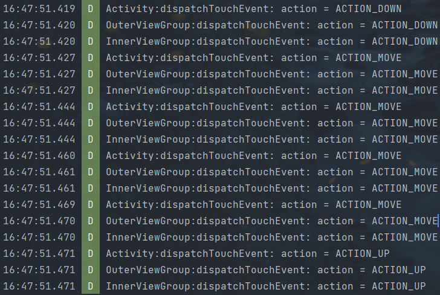
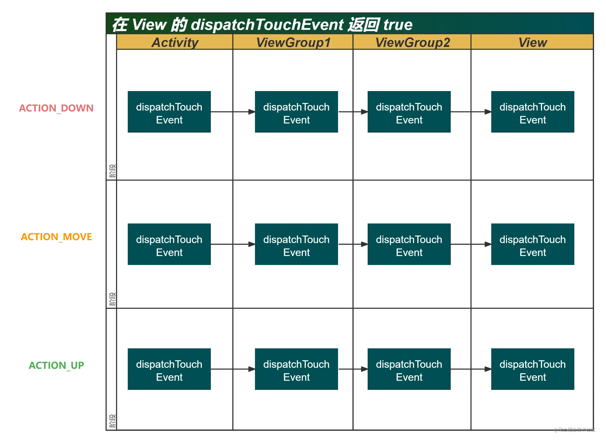

## 什么是事件分发

📐点击事件的事件分发，其实就是对`MotionEvent`事件的分发过程，即一个MotionEvent产生了以后，系统需要把这个事件传递给一个具体的View，而这个传递的过程就是分发过程。

📐事件分发过程由三个重要的方法共同完成：`dispatchTouchEvent`、`onInterceptTouchEvent`、`onTouchEvent`。

### dispatchTouchEvent

* 用来进行事件的分发。
* 返回值表示是否消耗当前事件。(返回True就不向下分发事件即拦截事件)
* 当事件传递给当前View时，该方法就一定会被调用。

### onInterceptTouchEvent

* 返回结果表示是否拦截当前事件。
* 在ViewGroup内部的dispatchTouchEvent调用，如果当前View拦截了某个事件，那么在同一个事件序列中，此方法将不再调用。
* **该方法只存在与ViewGroup，普通View没有该方法。**

### onTouchEvent

* 在`dispatchTouchEvent`方法内调用，用于处理点击事件。

## 同一个事件序列

* 同一个事件序列指从手指接触屏幕至手指离开屏幕这个过程产生的一系列事件。这个事件序列从down事件开始，中间包含多个move事件，最终以up事件结束。
* **📐正常情况下，一个事件序列只能被一个View拦截且消耗。一旦这个View拦截了某个事件，则整个事件序列均交由它处理。**
* 

### 不消耗ACTION_DOWN事件

* 不消耗ACTION_DOWN事件指的是(onTouchEvent)返回false。

## [理解 View 的事件分发机制](https://juejin.cn/post/7067698735874539527)

🎈重写 `OuterViewGroup`，`InnerViewGroup`，`MyView` 和 `Activity` 的 `dispatchTouchEvent`，`onTouchEvent` 方法，日志打印出他们的调用顺序，即可得到 View 事件分发的过程。

### 1. 默认情况

|事件|结果|
|--|--|
|ACTION_DOWN|ACTION_DOWN 由 Activity 的 dispatchTouchEvent **一直传递到** MyView 的 dispatchTouchEvent，然后由 MyView 的 onTouchEvent **向外传递到** Activity 的 onTouchEvent|
|ACTION_MOVE|ACTION_MOVE 是在 ACTION_DOWN 事件后产生的，因为没有任何的 Activity 或 View 对 ACTION_DOWN 事件拦截，所以 ACTION_MOVE 传递到了 Activity 后就停止了。可以发现，**ACTION_MOVE 事件的传递是受 ACTION_DOWN 事件影响的**|
|ACTION_UP|和 ACTION_MOVE 事件一样，受 ACTION_DOWN 事件拦截影响，ACTION_UP 传递到 Activity 后也停止向下传递了|

### 总结

1. 对于 ACTION_DOWN 事件，会从最外层的 `dispatchTouchEvent` 传递到最内层的 `dispatchTouchEvent`，然后由最内层的 `onTouchEvent` 传递到最外层的 `onTouchEvent`。
2. 对于 ACTION_MOVE 和 ACTION_UP 来说，只会传递到 Activity 的 `dispatchTouchEvent` 和 `onTouchEvent` 中。

### 2. 在 dispatchTouchEvent 中拦截事件（dispatchTouchEvent返回true）

#### 2.1 在 Activity 的 dispatchTouchEvent 中拦截事件

|事件|结果|
|--|--|
|ACTION_DOWN|ACTION_DOWN 事件传递到 Activity 就停止向下传递了|
|ACTION_MOVE|与 ACTION_DOWN 事件一样传递到 Activity 就停止向下传递了|
|ACTION_UP|与 ACTION_DOWN 事件一样传递到 Activity 就停止向下传递了|

#### 2.2 在 ViewGroup 的 dispatchTouchEvent 中拦截事件（将`InnerViewGroup`的dispatchTouchEvent方法返回 true）

|事件|结果|
|--|--|
|ACTION_DOWN|因为在 `InnerViewGroup` 的 dispatchTouchEvent 拦截了所有事件，所以 ACTION_DOWN 事件只能从 `Activity` 传递到 `OuterViewGroup`再传递到 `InnerViewGroup`，而 `MyView` 接收不到任何事件|
|ACTION_MOVE|ACTION_MOVE 从 `Activity` 传递到 `OuterViewGroup`再传递到 `InnerViewGroup`，`MyView` 接收不到任何事件|
|ACTION_UP|ACTION_UP 从 `Activity` 传递到 `OuterViewGroup`再传递到 `InnerViewGroup`，`MyView` 接收不到任何事件|

#### 2.3 在 View 的 dispatchTouchEvent 中拦截事件

|事件|结果|
|--|--|
|ACTION_DOWN|ACTION_DOWN事件 从最外层（Activity）传递到了最内层（MyView）|
|ACTION_MOVE|ACTION_MOVE事件 从最外层（Activity）传递到了最内层（MyView）|
|ACTION_UP|ACTION_UP事件 从最外层（Activity）传递到了最内层（MyView）|

